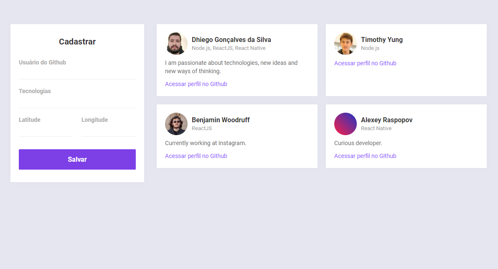
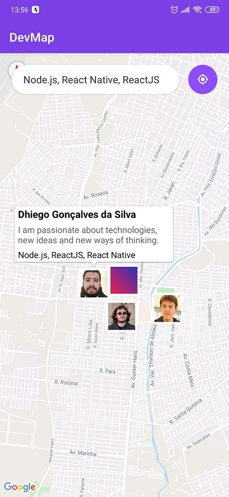
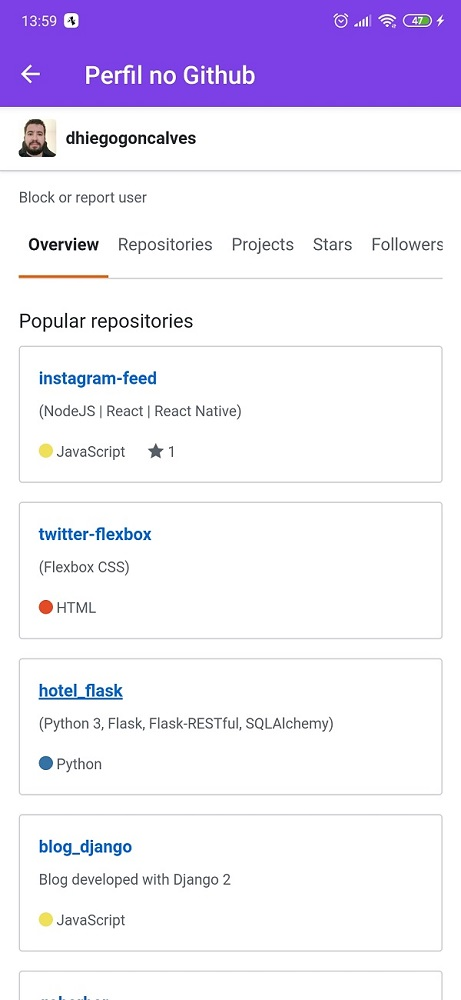

# DevMap

## 📚 Tecnologias

Esse projeto foi desenvolvido com as seguintes tecnologias:

- [Node.js](https://nodejs.org/en/)
- [React](https://reactjs.org)
- [React Native](https://facebook.github.io/react-native/)
- [Expo](https://expo.io/)
- [Socket](https://socket.io/)

## 💻 Projeto

O DevMap é um projeto que visa conectar desenvolvedores próximos a você que trabalham com as mesmas tecnologias.

<p align="center">
    
</p>

<p align="center">
    
    
</p>

## :checkered_flag: Iniciar a aplicacão

A aplicação está dividida em três partes, sendo elas: Backend, Frontend e Mobile.

## Backend

Depois de efetuar o download da aplicação, acesse a pasta `backend` e execute o comando abaixo para efetuar o download das dependências:

```console
yarn
```

_Depois renomeie o arquivo `.env.example` para `.env` e configure as variáveis de ambiente._

Para rodar a aplicação esteja na pasta `backend` e execute o comando:

```console
yarn dev
```

---

## Frontend

Acesse a pasta `frontend` e execute o comando abaixo para efetuar o download das dependências:

```console
yarn
```

_Depois renomeie o arquivo `.env.example` para `.env` e configure as variáveis de ambiente._

Para rodar a aplicação esteja na pasta `frontend` e execute o comando:

```console
yarn start
```

Em seguida, será aberto o endereço [http://localhost:3000](http://localhost:3000) em seu navegador.

---

## Mobile

Acesse a pasta `mobile` e execute o comando abaixo para efetuar o download das dependências:

```console
yarn
```

_No arquivo `environment.js` configure as variáveis de ambiente._

Para rodar a aplicação esteja na pasta `mobile` e execute o comando:

```console
yarn start
```

Em seguida, será aberto o endereço [http://localhost:19002](http://localhost:19002) em seu navegador.
